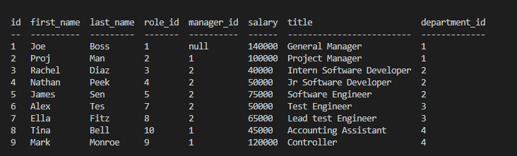

# Employee Tracker
  
  

  ## Table of Contents 

  1. [Description](#description) 

  2. [Installation](#installation-guidelines) 

  3. [License](#license) 

  4. [Preview](#preview)

  5. [Future](#future-development) 

  6. [Question](#questions) 

  ## Description 

  Command-line application that allows the user to view and interact with employee information stored in the database. 
 
  ## Installation guidelines 

  Have node.js installed on your machine. 
  run npm i to install dependencies.

  Required node packages: console.table, MySQL, dotenv, and inquirer.

  ## License 

  MIT 

  ## Preview

  Preview of "View Employees" choice
  

  Preview of "View Roles" choice
  

  Preview of "View Departments" choice  
  

  Demo video for adding new departments, roles,employees, and updating roles.
  

  Views after demo video:  
  Employees
  

  Roles
  

  Departments  
  

  ## Future development

  <ul> Add the following improvements:
    <li>Make the add employee function dynamic</li>
    <li>functions to delete departments, roles, and employees</li>
    <li>function to view employees by manager</li>
    <li>function to update employee managers</li>
    <li>function to view the total utilized budget of a department -- ie the combined salaries of all employees in that department</li>
</ul>

  ## Questions 
  Email me with additional questions at 
  Rachel7113@gmail.com